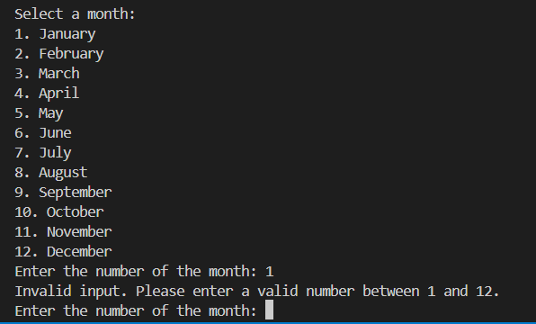
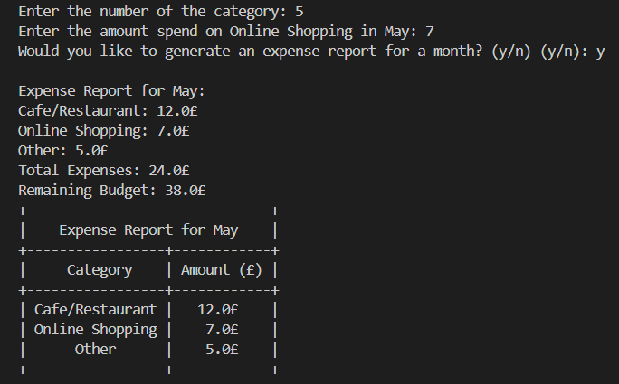

# Expense Manager

Expense Manager is a **Python-based terminal application** that allows users to **track monthly expenses, set budgets, and generate expense reports** efficiently using Google Spreadsheets. The system simplifies financial monitoring and budgeting, offering users an intuitive interface to input, analyze, and visualize their spending habits over time.

The application is **deployed on Heroku** and **integrates with Google Sheets** for data storage.

<p>The application is available for viewing <a href="https://expense-manage-bc56a7dbb585.herokuapp.com/">Expense Manager</a></p>

---
## Contents

- [About Expense Manager](#about-expense-manager)
- [User Stories](#user-stories)
- [Process Flow](#process-flow)
- [Application Features](#application-features)
- [Technology Used](#technology-used)
- [Testing](#testing)
- [Deployment](#deployment)
- [Future Enhancements](#future-enhancements)
- [Credits & Acknowledgments](#credits--acknowledgments)

---

## About Expense Manager

### Goals
The primary goal of **Expense Manager** is to provide a user-friendly platform that simplifies **personal finance management** for users of all levels of technical expertise. The system encourages **better financial planning** and **budget tracking** by allowing users to log expenses, adjust budgets, and generate detailed reports.

### Key Features
- **Set & Update Monthly Budgets**: Users can assign a budget to a specific month and modify it as needed.
- **Expense Logging by Category**: Expenses are categorized (Rent, Groceries, Vehicle, etc.) to ensure proper tracking.
- **Real-Time Google Sheets Integration**: All expenses and budgets are automatically saved to Google Sheets.
- **Detailed Expense Reports**: Users can generate and view expense summaries, including total spending and remaining budget.
- **Interactive Command-Line Interface**: Users navigate through easy-to-follow prompts to enter data.
- **Error Handling & Validation**: Ensures accurate data entry and prevents invalid inputs.

---

## User Stories

As a **user**, I want to:
- **Easily enter expenses** to track my spending accurately.
- **Update my budget dynamically** when needed.
- **Categorize expenses** to analyze where my money goes.
- **Generate reports** to compare my expenses with my budget.
- **See real-time updates in Google Sheets** to store my financial data securely.

---

## Process Flow

### How It Works

1. **Start Application**
    - The program initializes and authenticates with Google Sheets API.
    - Displays the **Expense Manager** ASCII header


2. **Set Monthly Budget**
    - User selects a **month** from the list (January - December).
    - If a budget exists, the user is prompted with:
      - **Update** (Replace the old value)
      - **Add to budget** (Increase current budget)
      - **Keep current budget** (No changes made)
    - Budget updates are reflected in **Google Sheets**

  


3. **Log an Expense**
    - User selects an **expense category** (Rent, Groceries, Vehicle, etc.).
    - Inputs the **expense amount**.
    - The system updates Google Sheets accordingly

 


4. **Generate an Expense Report** (Optional)
    - Displays **total expenses, remaining budget, and category-wise spending**.
    - If expenses exceed the budget, a **red warning message** appears.
    - If under budget, a **green congratulatory message** is shown.
    - Displays **formatted expense report table**

 


5. **Exit the Application**
    - The user can choose to exit or restart the process.

---

<h2>Flow Process</h2>


---

## Application Features

### Budget Management
- Allows users to **set monthly budgets**.
- Users can **modify or add to an existing budget**.
- Ensures **budget consistency across all months**.

### Expense Tracking
- Users can **log expenses under predefined categories**.
- Expense amounts are **validated** before submission.
- Expenses **automatically update in Google Sheets**.

### Report Generation
- Generates a **detailed monthly expense report**.
- Displays **total expenses vs. budget**.
- Categorizes spending and highlights **budget overages**.
- Uses **color-coded messages**:
  - **Green**: If under budget
  - **Red**: If over budget (**add screenshot of the warning message here**)

### Google Sheets Integration
- Automatically syncs **budgets and expenses** to Google Sheets.
- Ensures **data persistence and accessibility**.
- Allows users to **view and edit their financial records anytime**.

---


 <h2><b>Scope of Application</b></h2>
 <p>Expense Manager aims to cater to individuals looking for a simple yet effective way to track their personal finances, especially suited for those who prefer using Google Spreadsheets for data management.</p>

<h2><b>Strategy</b></h2>
<h3>Target Audience</h3>
<ul>
<li>Young adults managing their finances for the first time.</li>
<li>Experienced budgeters looking for a straightforward solution.</li>
</ul>
<h3>Key Information Deliverables</h3>
<ul>
<li>Monthly expense summary.</li>
<li>Category-wise spending breakdown.</li>
<li>Budget comparison insights.</li>
</ul>
<h3>Visual Simplicity</h3>
<p>The interface is designed with a focus on clarity and minimalism to prevent user fatigue and enhance readability.</p>

<h2>Aesthetics</h2>
<p>The UI will use a calm color palette to encourage stress-free financial management and incorporate responsive design principles to ensure functionality across devices.</p>

<h2>Wireframes/Flowchart</h2>


<h2><b>Features</b></h2>
<p>Monthly Budget Setting: Set a monthly budget for various categories.</p>

<p>Expense Logging: Log expenses by category for any selected month.</p>

<p>Report Generation: Generate and view a monthly expense report.</p>

<p>Google Spreadsheet to log all the expenses</p>


---

## Technology Used

### Programming Languages & Libraries
- **Python 3** - Core programming language.
- **gspread** - Google Sheets API integration.
- **PrettyTable** - Displays reports in table format.
- **Termcolor & Colorama** - Adds colored text for improved readability.
- **Art** - Generates ASCII text for branding.
- **Heroku** - Cloud deployment platform.
- 
---

## Testing

### Linter & Validation
- **PEP8 Validation**: Ensured clean and readable Python code.
- **Input Validation**: Handled invalid inputs for **month selection, category choice, and budget entry**.
- **Edge Cases Tested**:
  - Entering invalid month numbers.
  - Logging expenses without setting a budget.
  - Entering non-numeric values.
  - Handling budget overages and showing warnings.

### User Testing
Tested with multiple users for:
- **Correct flow of budget updates and expenses**.
- **Google Sheets synchronization accuracy**.
- **Expense tracking across multiple months**.
- **Error handling improvements based on feedback**.

---

<h2><b>Validator Testing</b></h2>
<p>Expense Manager app was tested using Python Linter
    


<h2>User Testing</h2>

**1. Error: Infinite Loop in Budget Update Confirmation**
```python
Current budget for January: £100
Are you sure you want to update the budget? (y/n): y
Budget updated successfully for January.
Current budget for January: £100
Are you sure you want to update the budget? (y/n): y
Budget updated successfully for January.
```
- The program was asking "Are you sure you want to update the budget?" twice due to redundant calls inside a loop.
- After updating the budget, it was displaying the same question again unnecessarily.

**Solution:**
- Refactored the code to only ask once before updating the budget.
  
```python
        confirm = input("Are you sure you want to update the budget? (y/n): ").lower()
        if confirm == 'y':
            expenses.update_cell(month_cell.row, 2, budget)
            print(f"Budget updated successfully for {month}.")
        else:
            print("Budget update cancelled.")
```
---
**2. Error: Validation Errors in Month and Category Selection**

```python
Enter the month number (1-12): March
Invalid input. Please enter a numeric value.
```
```python
Enter the number of the category: 7
Invalid input. Please enter a valid category number.
```
- Users were entering text instead of numbers for months, causing a validation error.
- Categories were numbered 1-6, but users were entering numbers outside the valid range.

**Solution:**

- Added stronger input validation to ensure:
    - The month input is numeric and within 1-12.
    - The category input is numeric and within the valid category range.

```python
while True:
        try:
            month_index = int(input("Enter the month number (1-12): "))
            if 1 <= int(month_index) <= 12:
                return months[month_index - 1]
            else:
                print(colored("Invalid choice. Please enter a number between 1 and 12.", "red"))
        except ValueError:
            print(colored("Invalid input. Please enter a numeric value.", "red"))
```
```python
while True:
        try:
            cat_choice = int(input("Enter the number of the category: "))
            if cat_choice in categories:
                return categories[cat_choice]
            else:
                print(colored("Invalid input. Please enter a valid category number.", "yellow"))
        except ValueError:
            print(colored("Invalid input. Please enter a numeric value.", "yellow"))
```
```python
```

```python
```
```python
```

**3. Error: Invalid Color Name "Orange" in termcolor**

```python
  File "/app/.heroku/python/lib/python3.12/site-packages/termcolor/termcolor.py", line 171, in colored
    result = fmt_str % (COLORS[color], result)
                        ~~~~~~^^^^^^^
KeyError: 'orange'
```
- termcolor does not support the color "orange".
- Only valid colors include red, green, yellow, blue, magenta, cyan, white, grey.

**Solution**
Replaced "orange" with "yellow".

```python
print(colored("Invalid input. Please enter a valid category number.", "yellow"))
```
            
<h2>Terminal Results</h2>


<h2>Spreadsheet</h2>


---

## Deployment

### Cloning & Forking
#### Fork
1. On GitHub.com, navigate to the [HiraniPJ/Expense-Manager](https://github.com/HiraniPJ/Expense-Manager) repository.
2. In the top-right corner of the page, click Fork.
3. By default, forks are named the same as their parent repositories. You can change the name of the fork to distinguish it further.
4. Add a description to your fork.
5. Click Create fork.

#### Clone
1. Above the list of files click the button that says 'Code'.
2. Copy the URL for the repository.
3. Open Terminal. Change the directory to the location where you want the cloned directory.
4. Type git clone, and then paste the URL
5. Press Enter.

### Local Deployment
1. Sign up to [Gitpod](https://gitpod.io/)
2. Download the Gitpod browser extension.
3. On GitHub.com, navigate to the [HiraniPJ/Expense-Manager](https://github.com/HiraniPJ/Expense-Manager) repository.
4. Above the list of files click the button that says 'Gitpod'.
5. Once open you will need to install the libraries, you can do this by typing "pip3 install -r requirements.txt" into the terminal

### Remote Deployment 
 The prgoram was deployed to Heroku. If you have forked/cloned the repository the steps to deploy are:
 1. On Heroku, create a new app.
 2. input a name for your app
 3. Click on the settings tab
 4. Scroll to the Config Vars and click on the "Reveal Config Vars"
 5. Input CREDS into the key field and the content of the Google API creds file into the value area.
 6. Add another config, PORT into key and 8000 into value.
 7. Set the buildbacks to Python and NodeJs in that order .
 8. Link your Heroku app to you repository.
 9. Click on Deploy.
 10. The page will then provide the url to the python terminal.

 The live link can be found here - [Expense-Manager](https://expense-manage-bc56a7dbb585.herokuapp.com/)
 
### Google Sheet
The program uses a Google Sheets to store saved graphs and mazes. 

1. Sign up to a [Google Account](https://support.google.com/accounts/answer/27441?hl=en#)
2. Open Google Sheets and create a new spreadsheet. [Click here for Google Sheets](https://docs.google.com/spreadsheets/)
3. Change the name of the spreadsheet to 'Expense-Manager'
    ```python
    SHEET = GSPREAD_CLIENT.open('Expense-Manager')
    ```
4. You now need to change the name of the worksheet to 'saves'
5. The google sheet is now complete

Now you need to get the API credentials from the [Google Cloud Platform](https://console.cloud.google.com/)

1. Create a new project and give it a name.
2. Select APIs and services from the navigation pane. 
3. Now click Library
4. Search for the Google Sheets and click enable.
5. Search for the google Drive API and click enable.
6. Click create credentials and from the drop down select Google Drive API.
7. From the form select Application data
8. Then click No for "are you planning to use this API with compute Engine, Kubernetes engine, App engine or cloud Functions?"
9. Press Create and Continue.
10. Select a role of Editor from the options and click "Done"
11. Navigate to the service account on the credentials page. 
12. On the tab click KEYS then ADD KEY.
13. The Key type will need to be JSON
14. Copy the downloaded JSON file into your repository and name it "creds.json"
15. ADD THE "creds.json" FILE TO .gitignore FILE. DO NOT SHARE PUBLICLY.
16. 
---

## Future Enhancements
- **Undo Last Transaction**: Ability to revert the last logged expense.
- **Graphical Reports**: Generate **charts and graphs** for better visualization.
- **Multi-User Support**: Allow multiple users with authentication.
- **Mobile App Integration**: Sync data with a mobile app.

---

## Credits & Acknowledgments

Special thanks to:
- **Code Institute** - Learning resources and project structure guidance.
- **Google Sheets API Documentation** - Integration assistance.
- **Stack Overflow & YouTube Tutorials** - Troubleshooting and debugging.
